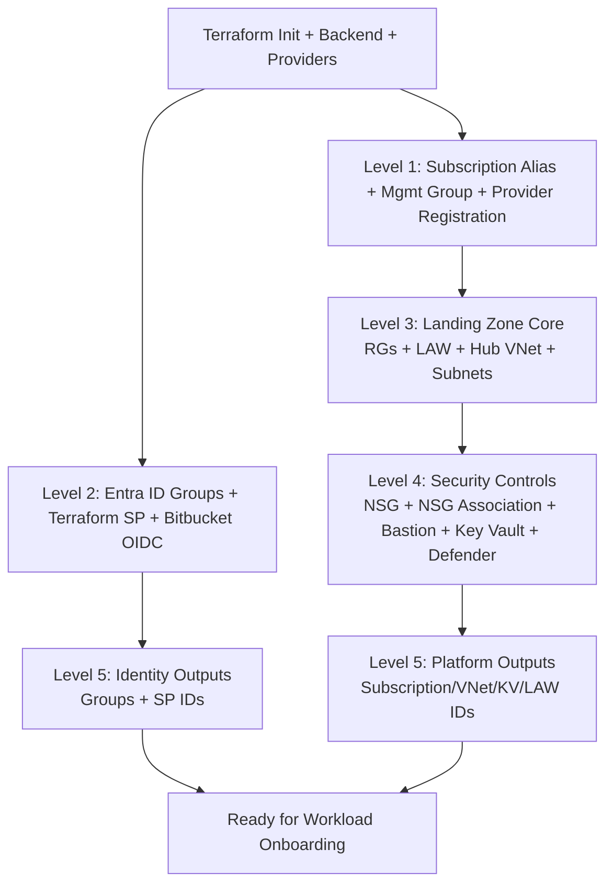

# terraform-azure-landingzone

> **Project:** OF Bank — Azure Cloud Foundation  
> **Status:** Infrastructure provisioning — no prior architecture deployed  
> **IaC Tool:** Terraform  
> **Source Control:** Bitbucket  
> **State Backend:** HCP Terraform (Terraform Cloud)

---

## 📋 Overview

This repository provisions the **Azure Cloud Foundation** for OF Bank. It establishes the core platform components that all workloads depend on, following Microsoft's Cloud Adoption Framework (CAF) and Azure Landing Zone architecture principles.

---

## 🏗️ Architecture Components

### 1. Azure Subscription

An Azure Subscription is the top-level billing and resource boundary within an Azure tenant.

| Aspect | Detail |
|---|---|
| **Purpose** | Isolate environments (Production, Non-Prod, Shared Services) and control costs |
| **Structure** | One subscription per environment recommended for large enterprises |
| **Management** | Grouped under Management Groups for policy inheritance |
| **Billing** | Each subscription has its own cost reporting and spending limits |

**Provisioned Resources:**
- Subscription aliases (programmatic subscription creation)
- Management Group associations
- Resource Providers registration (required for services like AKS, KeyVault, etc.)
- Subscription-level diagnostic settings → Log Analytics

---

### 2. Azure Landing Zone

A Landing Zone is a pre-configured, policy-compliant Azure environment that provides networking, security, identity, and governance guardrails for workloads.

| Aspect | Detail |
|---|---|
| **Purpose** | Standardised, secure, scalable environment scaffold for workloads |
| **Networking** | Hub-and-Spoke topology with Azure Virtual WAN or traditional VNet peering |
| **Security** | Azure Policy assignments, Microsoft Defender for Cloud, NSG baselines |
| **Connectivity** | ExpressRoute / VPN Gateway for on-premises hybrid connectivity |
| **Governance** | Azure Policy, RBAC, Blueprints / Deployment Stacks |

**Provisioned Resources:**
- Resource Groups (per domain: networking, security, shared-services)
- Virtual Network (Hub VNet) + subnets
- Azure Firewall or Network Virtual Appliance (NVA)
- Azure Bastion (secure VM access)
- Network Security Groups (NSGs) with baseline rules
- Route Tables (UDR — force-tunnelling to firewall)
- Azure Key Vault (central secrets store)
- Log Analytics Workspace (centralised logging)
- Azure Monitor + Diagnostic Settings
- Azure Policy assignments (CIS / NIST baselines)
- Role assignments (RBAC — least privilege)

---

### 3. Microsoft Entra ID (Azure Active Directory)

Entra ID is Microsoft's cloud-based identity and access management (IAM) service — the security backbone of the Azure platform.

| Aspect | Detail |
|---|---|
| **Purpose** | Centralised identity, authentication, and authorisation |
| **Tenant** | Single Entra ID tenant per organisation |
| **Groups** | Security groups for RBAC, app access, and Conditional Access |
| **Service Principals** | Non-human identities for automation (Terraform, CI/CD pipelines) |
| **Managed Identities** | Azure-native identity for resources (no secrets required) |
| **MFA / CA** | Conditional Access policies enforce MFA for all privileged access |

**Provisioned Resources:**
- Entra ID Groups (Platform Admins, Developers, Read-Only, etc.)
- Service Principal for Terraform (federated identity / OIDC with Bitbucket)
- App Registrations (if required for workloads)
- Conditional Access policies (via Microsoft Graph)
- Directory Role assignments (limited — Global Admin excluded from IaC)

---

### 4. Management Groups

Azure Management Groups provide a governance scope above subscriptions.

```
Tenant Root Group
└── OF Bank (mg-ofbank)
    ├── Platform (mg-ofbank-platform)
    │   ├── Management     ← Log Analytics, Automation
    │   ├── Connectivity   ← Networking hub
    │   └── Identity       ← AD DS, Entra ID connectors
    └── Landing Zones (mg-ofbank-landingzones)
        ├── Production     ← Prod workloads
        └── Non-Production ← Dev, UAT, Staging
```

---

## 🔄 Architecture Flow (Chronological Deployment Levels)

This is the deployment sequence followed by the current Terraform code.

### Level 0 — Terraform Platform Bootstrap

1. Terraform initializes providers and backend (`azurerm`, `azuread`, `azapi`, HCP Terraform backend).
2. Input variables and locals are loaded.

### Level 1 — Subscription Foundation

1. Create Azure Subscription alias (`Microsoft.Subscription/aliases`).
2. Attach subscription to the target Management Group.
3. Register required Azure Resource Providers:
    - `Microsoft.Compute`
    - `Microsoft.Network`
    - `Microsoft.KeyVault`
    - `Microsoft.Security`
    - and others in the module list.

### Level 2 — Identity Foundation (Parallel to Level 1)

1. Create Entra ID security groups:
    - Platform Admins
    - Developers
    - Read Only
    - Network Admins
2. Create Terraform App Registration + Service Principal.
3. Configure Bitbucket OIDC federated identity credential.

### Level 3 — Landing Zone Core (Depends on Level 1)

1. Create resource groups:
    - Networking
    - Security
    - Shared Services
2. Create Log Analytics Workspace.
3. Create Hub Virtual Network.
4. Create subnets:
    - `AzureFirewallSubnet`
    - `AzureBastionSubnet`
    - `GatewaySubnet`
    - `snet-shared-services`

### Level 4 — Security and Operations Controls

1. Create NSG with baseline deny inbound rule.
2. Associate NSG to shared services subnet.
3. Create Bastion public IP.
4. Deploy Azure Bastion host.
5. Create central Key Vault with network ACL restrictions.
6. Enable Microsoft Defender for Cloud pricing plans.

### Level 5 — Outputs and Handover

1. Export key IDs and references:
    - Subscription ID
    - Hub VNet ID
    - Key Vault ID
    - Log Analytics Workspace ID
    - Entra ID group IDs
    - Terraform SP client/object IDs

### End-to-End Flow (Visual)



### Chronological Run Order Summary

| Order | Terraform Module | Result |
|---|---|---|
| 1 | `module.subscription` | Subscription and provider readiness |
| 2 | `module.entra_id` | Identity groups and Terraform SP |
| 3 | `module.landing_zone` | Network, security, monitoring baseline |
| 4 | root outputs | IDs for downstream workload repos |

> Note: `module.landing_zone` explicitly depends on `module.subscription`. `module.entra_id` can run in parallel with subscription creation.

---

## 📁 Repository Structure

```
terraform-azure-landingzone/
├── README.md                   # This file
├── main.tf                     # Root module — calls submodules
├── variables.tf                # Root input variables
├── outputs.tf                  # Root outputs
├── providers.tf                # Azure & AzureAD provider config
├── terraform.tf                # Version constraints
├── backend.tf                  # HCP Terraform backend
├── locals.tf                   # Shared local values
├── modules/
│   ├── subscription/           # Azure Subscription provisioning
│   │   ├── README.md
│   │   ├── main.tf
│   │   ├── variables.tf
│   │   └── outputs.tf
│   ├── landing-zone/           # Hub networking, security, governance
│   │   ├── README.md
│   │   ├── main.tf
│   │   ├── variables.tf
│   │   └── outputs.tf
│   └── entra-id/               # Entra ID groups, SPs, role assignments
│       ├── README.md
│       ├── main.tf
│       ├── variables.tf
│       └── outputs.tf
└── examples/
    └── basic/
        ├── README.md
        └── main.tf
```

---

## 🚀 Getting Started

### Prerequisites

| Tool | Minimum Version |
|---|---|
| Terraform | `>= 1.9.0` |
| Azure CLI | `>= 2.60.0` |
| HCP Terraform account | n/a |

### Authentication

```bash
# Login to Azure
az login

# Set target subscription
az account set --subscription "<SUBSCRIPTION_ID>"

# Export for Terraform
export ARM_SUBSCRIPTION_ID="<SUBSCRIPTION_ID>"
export ARM_TENANT_ID="<TENANT_ID>"
```

For CI/CD (Bitbucket Pipelines), use a Service Principal with OIDC:

```bash
export ARM_CLIENT_ID="<SP_CLIENT_ID>"
export ARM_TENANT_ID="<TENANT_ID>"
export ARM_USE_OIDC=true
```

### Deploy

```bash
terraform init
terraform plan -var-file="environments/prod.tfvars"
terraform apply -var-file="environments/prod.tfvars"
```

### If subscription already exists

Use the existing subscription by setting:

- `create_subscription = false`
- `subscription_id = "<EXISTING_SUBSCRIPTION_ID>"`

Example:

```hcl
create_subscription = false
subscription_id     = "00000000-0000-0000-0000-000000000000"
tenant_id           = "11111111-1111-1111-1111-111111111111"
environment         = "nonprod"
location            = "australiaeast"
```

In this mode, Terraform skips subscription creation and deploys only Entra ID + Landing Zone resources into your existing subscription.

### One-go deployment from Bitbucket (recommended)

Use a single JSON file for Terraform inputs.

1. Copy [config/deploy.inputs.example.json](config/deploy.inputs.example.json) to `config/deploy.inputs.json`
2. Fill real values
3. Push to Bitbucket (or keep the file generated in pipeline)

Required fields in `config/deploy.inputs.json`:

- `create_subscription` (set `false` for your case)
- `subscription_id` (**ID required**, not just name)
- `tenant_id`
- `environment`
- `location`

Common optional fields:

- `hub_address_space`
- `log_retention_days`
- `cost_centre`

Bitbucket repository variables required:

- `AZURE_CLIENT_ID`
- `AZURE_TENANT_ID`
- `AZURE_SUBSCRIPTION_ID`
- `TF_API_TOKEN`

Notes:

- Subscription **name** is useful for humans, but Terraform auth and provider target use `subscription_id`.
- Keep secrets in Bitbucket variables / HCP Terraform variables, not in JSON files.

---

## 🔐 Security Notes

- **No secrets** are stored in this repository
- Sensitive variables (client secrets, passwords) are stored in **HCP Terraform workspace variables** (marked sensitive)
- State is stored remotely in **HCP Terraform** — never committed locally
- Service Principal uses **Federated Identity (OIDC)** — no client secrets required for CI/CD

---

## 📎 References

- [Azure Landing Zones — Microsoft CAF](https://learn.microsoft.com/en-us/azure/cloud-adoption-framework/ready/landing-zone/)
- [Microsoft Entra ID Documentation](https://learn.microsoft.com/en-us/entra/identity/)
- [Terraform AzureRM Provider](https://registry.terraform.io/providers/hashicorp/azurerm/latest/docs)
- [Terraform AzureAD Provider](https://registry.terraform.io/providers/hashicorp/azuread/latest/docs)
- [HCP Terraform](https://developer.hashicorp.com/terraform/cloud-docs)
